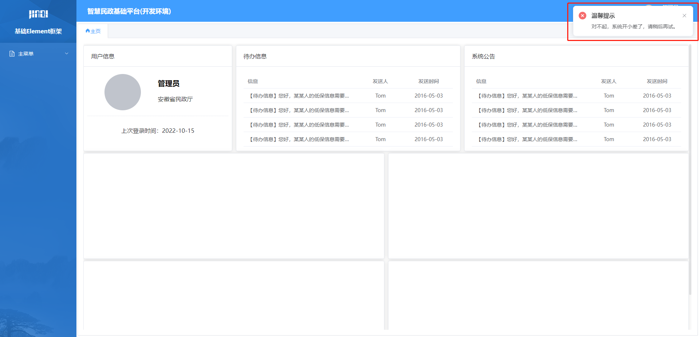

# zhm-vue-base框架

第一步：安装依赖

> yarn install

第二步：找到项目路径

> cd /zhmz-vue-base

第三步：运行

> yarn dev

## 工具类说明

### notification



概述：通知工具类

引用：

```javascript
import { notificationMsg } from"@/utils/notification"；
```

使用：

```javascript
/**
 * @param msgType 弹框类型（/utils/common/notificationType）
 */
notificationMsg(notificationType.error)；
```

### request

概述：请求工具类

引用：

```javascript
import { request } from"@/utils/request";
```

使用：

```javascript
/**
 * 请求
 * @param {string} url
 * @param {string} options 请求参数 {micservice:微服务前缀，pramas:参数，method:请求方法（post,get）}
 */
let res=awaitrequest("/users", {

  method:"post",

  params: {},

});
```
